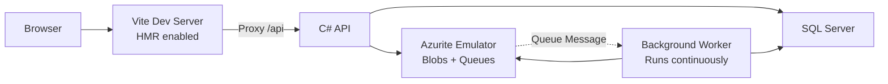
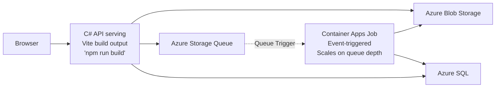

# Image Gallery with Event-Triggered Azure Container Apps Jobs

Upload images to Azure Blob Storage with queue-triggered thumbnail generation. Demonstrates event-driven Container Apps Jobs with queue-based autoscaling, managed identity authentication, and Azure SQL free tier - **can run entirely within Azure free tier limits**.

## Architecture

**Run Mode:**


**Publish Mode:**


## How It Works

### Event-Driven Thumbnail Processing

1. **Upload**: User uploads image → API saves to Azure Blob Storage and metadata to Azure SQL
2. **Queue**: API enqueues thumbnail generation message to Azure Storage Queue
3. **Trigger**: Azure monitors queue depth and automatically starts a Container Apps Job instance
4. **Process**: Job processes messages in batches (up to 10), generates thumbnails using ImageSharp
5. **Scale Down**: After 2 empty polls (~5 seconds), job exits; new instances start automatically when messages arrive

### Local Development vs Production

**Production (Event-Triggered):**
- Job starts when queue depth > 0, exits within ~5 seconds when empty
- API and worker both scale to zero when idle

**Local Development (Continuous):**
- Worker runs continuously, polls every 5 seconds
- Instant feedback with Azurite emulator and SQL Server container

## What This Demonstrates

- **Event-Driven Jobs**: Container Apps Jobs with queue-based autoscaling rules using Azure.Provisioning APIs
- **Dual-Mode Resources**: Azurite/SQL Server containers locally, Azure services in production (`.RunAsEmulator()`, `.RunAsContainer()`)
- **Free Tier Deployment**: Azure SQL free tier with serverless auto-pause, Container Apps scale-to-zero
- **Managed Identity**: Password-less authentication to all Azure resources (Storage, SQL, Queues)
- **Polyglot Stack**: Vite+React frontend embedded in C# API container, ImageSharp for image processing
- **OpenTelemetry**: Distributed tracing across upload → queue → worker pipeline

## Running

```bash
aspire run
```

## Commands

```bash
aspire run      # Run locally with Azurite
aspire publish  # Generate Bicep files to explore deployment artifacts (output in ./aspire-output)
aspire deploy   # Deploy to Azure Container Apps
```

## Security Notes

**Implemented:**
- ✅ **Managed Identity**: Password-less authentication to all Azure resources (no connection strings or secrets)
- ✅ **XSRF Protection**: Antiforgery tokens protect upload/delete endpoints from cross-site request forgery attacks
- ✅ **Input Validation**: 10 MB file size limit, extension allowlist (.jpg, .jpeg, .png, .gif, .webp)
- ✅ **Filename Sanitization**: Path traversal prevention, 255 char limit
- ✅ **Resource Limits**: Pagination (max 100 items), retry limits (3 attempts), size checks (20 MB max)

**Not Implemented (Required for Production):**
- ❌ **Authentication & Authorization**: Endpoints are public - anyone can upload/delete
- ❌ **Rate Limiting**: No protection against abuse or DoS

## Key Aspire Patterns

**Azure Storage Emulation** - Automatic Azurite in run mode, real Azure in publish:
```csharp
var storage = builder.AddAzureStorage("storage").RunAsEmulator();
var blobs = storage.AddBlobContainer("images");
var queues = storage.AddQueues("queues");
```

**Azure SQL Dual Mode** - SQL Server container locally, Azure SQL free tier in production:
```csharp
var sql = builder.AddAzureSqlServer("sql")
    .RunAsContainer()
    .AddDatabase("imagedb");
```

Defaults to Azure SQL free tier with serverless auto-pause (SKU: GP_S_Gen5_2).

**Scale to Zero** - API only runs when handling requests:
```csharp
api.PublishAsAzureContainerApp((infra, app) =>
{
    app.Template.Scale.MinReplicas = 0;
});
```

**Event-Triggered Container App Job** - Direct control over Azure resources with Azure.Provisioning libraries:

This example demonstrates using the **Azure.Provisioning** libraries to directly configure low-level Azure resources (Bicep/ARM) from the AppHost. This provides complete flexibility and control when Aspire's higher-level APIs don't expose specific features.

```csharp
worker.PublishAsAzureContainerAppJob((infra, job) =>
{
    // Direct access to Azure Provisioning APIs - full control over Bicep/ARM templates

    // Get storage account name for queue authentication
    var accountNameParameter = queues.Resource.Parent.NameOutputReference.AsProvisioningParameter(infra);

    // Configure event-driven trigger using Container Apps Job APIs
    job.Configuration.TriggerType = ContainerAppJobTriggerType.Event;
    job.Configuration.EventTriggerConfig.Scale.Rules.Add(new ContainerAppJobScaleRule
    {
        Name = "queue-rule",
        JobScaleRuleType = "azure-queue",
        Metadata = new ObjectExpression(
            // Bicep expressions - referencing other resources dynamically
            new PropertyExpression("accountName", new IdentifierExpression(accountNameParameter.BicepIdentifier)),
            new PropertyExpression("queueName", new StringLiteralExpression("thumbnails")),
            new PropertyExpression("queueLength", new IntLiteralExpression(1)) // Start job when 1+ messages
        ),
        Identity = identityAnnotation.IdentityResource.Id.AsProvisioningParameter(infra) // Use managed identity
    });
});
```

This approach gives you full control over Azure resource configuration without waiting for Aspire abstractions to expose every feature. The C# strongly-typed APIs generate correct Bicep/ARM templates with automatic dependency tracking and parameter passing between resources. You can seamlessly mix high-level Aspire APIs with low-level Azure Provisioning when you need fine-grained control.

**Dual-Mode Worker** - Continuous in run mode, event-triggered in publish mode:
```csharp
// AppHost: Set environment variable only in run mode
if (builder.ExecutionContext.IsRunMode)
{
    worker = worker.WithEnvironment("WORKER_RUN_CONTINUOUSLY", "true");
}

// Worker: Adapt behavior based on mode
if (_configuration.GetValue<bool>("WORKER_RUN_CONTINUOUSLY"))
{
    // Local dev: poll every 5 seconds, run forever
    await ExecuteContinuousAsync(stoppingToken);
}
else
{
    // Production: poll up to 2 times (5s intervals), exit when empty
    // MaxEmptyPolls = 2, EmptyPollWaitSeconds = 5
    await ExecuteScheduledAsync(stoppingToken);
}
```

**Graceful Shutdown** - Event-triggered mode always stops, exceptions crash naturally:
```csharp
if (_configuration.GetValue<bool>("WORKER_RUN_CONTINUOUSLY"))
{
    // Continuous mode: run forever, let exceptions crash the app
    await ExecuteContinuousAsync(stoppingToken);
}
else
{
    try
    {
        // Event-triggered mode: process messages until queue empty, then shutdown
        await ExecuteScheduledAsync(stoppingToken);
    }
    finally
    {
        // Always stop application when done (success or exception)
        // New instances will start automatically when queue has messages
        _hostApplicationLifetime.StopApplication();
    }
}
```

**Container Files Publishing** - Embed Vite build output in API container:
```csharp
api.PublishWithContainerFiles(frontend, "wwwroot");
```

## Performance & Cost Characteristics

**Response Times:**
- Thumbnail generation: typically ready within seconds of upload
- Local development: instant feedback with continuous polling

**Cost Optimization:**
- **Compute**: API and worker scale to zero when idle (~5 seconds), only pay for active processing
- **SQL**: Free tier with serverless auto-pause (GP_S_Gen5_2), free up to monthly limits
- **Storage**: Pay only for blob storage used, queues/blobs have minimal costs at low volumes
- **Result**: Can run entirely within Azure free tier limits

**Further optimization:** Using SAS URLs instead of API blob streaming would eliminate compute/egress costs for serving images

**Scalability:**
- Parallel job instances spawn automatically for high queue depth
- Batch processing (up to 10 messages per poll)
- Managed identity eliminates secrets management overhead
