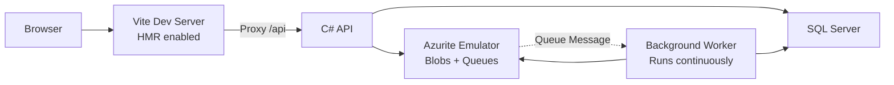
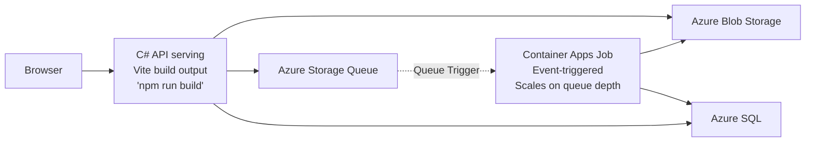

# Image Gallery with Azure Container Apps Jobs

Upload images to Azure Blob Storage with queue-triggered thumbnail generation. Background worker processes thumbnails using Container Apps Jobs.

## Architecture

**Run Mode:**


**Publish Mode:**


## What This Demonstrates

- **AddAzureStorage**: Blob storage and queues with automatic `.RunAsEmulator()` for local development
- **AddAzureSqlServer**: SQL Server container in run mode, Azure SQL in publish mode with `.RunAsContainer()`
- **PublishAsAzureContainerApp**: API scales to zero when idle, reducing costs
- **PublishAsAzureContainerAppJob**: Event-triggered worker that automatically scales based on queue depth
- **Queue-Triggered Scaling**: Job instances start instantly when messages arrive, exit within ~5 seconds when queue is empty
- **Dual-Mode Worker**: Continuous polling (5s) in run mode for instant feedback, event-driven scaling in publish mode for maximum cost efficiency
- **PublishWithContainerFiles**: Vite frontend embedded in API container
- **WaitFor**: Ensures dependencies start in correct order
- **OpenTelemetry**: Distributed tracing across upload → queue → worker pipeline

## Running

```bash
aspire run
```

## Commands

```bash
aspire run      # Run locally with Azurite
aspire deploy   # Deploy to Azure Container Apps
```

## Security Notes

This is a sample application for demonstration purposes. For production use, consider:

- **Authentication & Authorization**: Add authentication to protect upload/delete endpoints
- **Rate Limiting**: Implement rate limiting to prevent abuse
- **CORS Policy**: Configure CORS for allowed origins only
- **Blob Access Control**: Use SAS tokens with limited permissions instead of direct URLs
- **Input Validation**: File size limited to 10 MB, formats restricted to .jpg, .jpeg, .png, .gif, .webp
- **Content Validation**: Filenames are sanitized to prevent path traversal attacks
- **Resource Limits**: Pagination (max 100 items), retry limits (3 attempts), size checks before processing

## Key Aspire Patterns

**Azure Storage Emulation** - Automatic Azurite in run mode, real Azure in publish:
```csharp
var storage = builder.AddAzureStorage("storage").RunAsEmulator();
var blobs = storage.AddBlobContainer("images");
var queues = storage.AddQueues("queues");
```

**Azure SQL Dual Mode** - SQL Server container locally, Azure SQL in production:
```csharp
var sql = builder.AddAzureSqlServer("sql")
    .RunAsContainer()
    .AddDatabase("imagedb");
```

**Scale to Zero** - API only runs when handling requests:
```csharp
api.PublishAsAzureContainerApp((infra, app) =>
{
    app.Template.Scale.MinReplicas = 0;
});
```

**Event-Triggered Container App Job** - Worker scales based on queue depth:
```csharp
worker.PublishAsAzureContainerAppJob((infra, job) =>
{
    var accountNameParameter = queues.Resource.Parent.NameOutputReference.AsProvisioningParameter(infra);

    job.Configuration.TriggerType = ContainerAppJobTriggerType.Event;
    job.Configuration.EventTriggerConfig.Scale.Rules.Add(new ContainerAppJobScaleRule
    {
        Name = "queue-rule",
        JobScaleRuleType = "azure-queue",
        Metadata = new ObjectExpression(
            new PropertyExpression("accountName", new IdentifierExpression(accountNameParameter.BicepIdentifier)),
            new PropertyExpression("queueName", new StringLiteralExpression("thumbnails")),
            new PropertyExpression("queueLength", new IntLiteralExpression(1))
        ),
        Identity = identityAnnotation.IdentityResource.Id.AsProvisioningParameter(infra)
    });
});
```

**Dual-Mode Worker** - Continuous in run mode, event-triggered in publish mode:
```csharp
// In run mode: runs continuously for instant local feedback
if (builder.ExecutionContext.IsRunMode)
{
    worker = worker.WithEnvironment("WORKER_RUN_CONTINUOUSLY", "true");
}

// Worker adapts behavior based on mode
var runContinuously = _configuration.GetValue<bool>("WORKER_RUN_CONTINUOUSLY");
if (runContinuously)
{
    // Local dev: poll every 5 seconds, run forever
    await Task.Delay(TimeSpan.FromSeconds(5), stoppingToken);
}
else
{
    // Production: event-triggered, poll 1-2 times then exit if empty
    // New job instances start automatically when messages arrive
    if (emptyPollCount >= MaxEmptyPolls) // MaxEmptyPolls = 2
    {
        _logger.LogInformation("Queue empty, exiting");
        break;
    }
}
```

**Graceful Shutdown** - Event-triggered mode always stops, exceptions crash naturally:
```csharp
if (_configuration.GetValue<bool>("WORKER_RUN_CONTINUOUSLY"))
{
    // Continuous mode: run forever, let exceptions crash the app
    await ExecuteContinuousAsync(stoppingToken);
}
else
{
    try
    {
        // Event-triggered mode: process messages until queue empty, then shutdown
        await ExecuteScheduledAsync(stoppingToken);
    }
    finally
    {
        // Always stop application when done (success or exception)
        // New instances will start automatically when queue has messages
        _hostApplicationLifetime.StopApplication();
    }
}
```

**Container Files Publishing** - Embed Vite build output in API container:
```csharp
api.PublishWithContainerFiles(frontend, "wwwroot");
```
