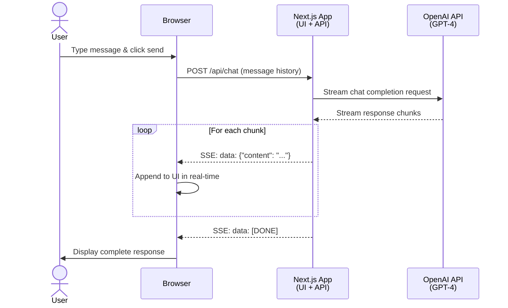

# Next.js + OpenAI Real-time Chat

Real-time chat application with OpenAI GPT-4 using Server-Sent Events (SSE) for streaming responses. Built with Next.js 15, TypeScript, and the OpenAI SDK.

## Architecture



## How It Works

### Server-Sent Events (SSE)
The application uses SSE for one-way streaming from server to client. This is ideal for LLM responses because:

- **Simple**: Browser-native `EventSource` API or fetch with ReadableStream
- **Efficient**: Keeps single HTTP connection open, minimal overhead
- **Standard**: Well-supported protocol for text streaming
- **Perfect for LLMs**: Responses flow one direction (server → client)

### Streaming Flow

1. **User sends message**: React app sends POST request with conversation history
2. **OpenAI streaming**: Next.js API route uses OpenAI SDK's `stream: true` option
3. **SSE conversion**: OpenAI chunks are converted to Server-Sent Events format
4. **Real-time updates**: Browser receives and displays each chunk as it arrives
5. **Completion**: `[DONE]` event signals end of stream

### Key Components

**API Route** (`app/api/chat/route.ts`):
- Node.js runtime with OpenTelemetry tracing
- OpenAI SDK with streaming enabled
- Converts OpenAI stream to SSE ReadableStream
- Proper SSE headers (`text/event-stream`, `no-cache`)

**Client** (`app/page.tsx`):
- Manages message history and UI state
- Reads SSE stream with `Response.body.getReader()`
- Updates UI in real-time as chunks arrive
- Handles connection lifecycle

## What This Demonstrates

- **SSE Streaming**: Server-Sent Events for real-time LLM responses
- **Next.js 15**: App Router with Route Handlers
- **OpenAI Integration**: GPT-4 streaming with official SDK and `Aspire.Hosting.OpenAI`
- **OpenTelemetry**: Distributed tracing with spans for API requests
- **TypeScript**: Full type safety across frontend and backend
- **Modern React**: Client components with hooks for state management
- **CSS Modules**: Scoped styling with modern gradient effects

## Running Locally

```bash
aspire run
```

You'll be prompted for your OpenAI API key on first run (stored securely by Aspire).

## Project Structure

```
nextjs-openai-chat/
├── apphost.cs                    # Aspire orchestration with OpenAI parameter
├── chat/
│   ├── app/
│   │   ├── layout.tsx            # Root layout with metadata
│   │   ├── page.tsx              # Chat UI with SSE client
│   │   ├── page.module.css       # Chat interface styles
│   │   ├── globals.css           # Global styles
│   │   └── api/
│   │       └── chat/
│   │           └── route.ts      # SSE endpoint with OpenAI streaming
│   ├── components/
│   │   ├── ChatMessage.tsx       # Message display component
│   │   └── ChatMessage.module.css
│   ├── package.json              # Next.js + OpenAI SDK dependencies
│   ├── next.config.js            # Standalone output for containers
│   └── tsconfig.json
```

## Key Aspire Patterns

### OpenAI Integration
Uses `Aspire.Hosting.OpenAI` package with `AddOpenAI()` for secure API key management. Aspire prompts for the key on first run and stores it securely.

```csharp
var openAi = builder.AddOpenAI("openai");
var chat = builder.AddNodeApp("chat", "./chat", "server.js")
                  .WithRunScript("dev")
                  .WithEnvironment("OPENAI_API_KEY", openAi.Resource.Key);
```

### Next.js Hosting
Uses `AddNodeApp` with `WithRunScript("dev")` for development mode and standalone build for containerization.

### OpenTelemetry Tracing
The API route includes OpenTelemetry instrumentation for distributed tracing. Each chat request creates a span with message count attributes, visible in the Aspire dashboard.

## SSE vs WebSocket vs Socket.io

This sample uses **Server-Sent Events** instead of WebSockets or Socket.io because:

| Feature | SSE | WebSocket | Socket.io |
|---------|-----|-----------|-----------|
| **Direction** | Server → Client | Bidirectional | Bidirectional |
| **Protocol** | HTTP | Custom | WebSocket + polling fallback |
| **Complexity** | Simple | Moderate | High (additional library) |
| **LLM Streaming** | ✅ Perfect | ⚠️ Overkill | ⚠️ Overkill + heavy |
| **Browser Support** | Native fetch | Native WebSocket | Requires library |
| **Reconnection** | Automatic | Manual | Built-in |

**For LLM streaming**: SSE is the standard choice (used by OpenAI, Anthropic, Vercel AI SDK, etc.) because responses only flow one direction.

**Use WebSocket/Socket.io for**: Multiplayer games, collaborative editing, or when client needs to frequently push data to server.

## Environment Variables

- `OPENAI_API_KEY`: Your OpenAI API key (provided via Aspire)
- `PORT`: Next.js server port (set by Aspire)
- `OTEL_EXPORTER_OTLP_ENDPOINT`: OpenTelemetry collector endpoint (set by Aspire)

## API Reference

### POST /api/chat

Streams GPT-4 responses using Server-Sent Events.

**Request**:
```json
{
  "messages": [
    { "role": "user", "content": "Hello!" },
    { "role": "assistant", "content": "Hi! How can I help?" },
    { "role": "user", "content": "Tell me a joke" }
  ]
}
```

**Response** (SSE):
```
data: {"content": "Why"}

data: {"content": " did"}

data: {"content": " the"}

data: {"content": " developer"}

data: {"content": " go"}

data: {"content": " broke"}

data: {"content": "?"}

data: [DONE]
```

Each chunk is sent as a separate `data:` event. The client concatenates them to build the complete response in real-time.

## Customization

### Change Model
Edit `app/api/chat/route.ts`:
```typescript
model: 'gpt-4-turbo-preview', // or 'gpt-3.5-turbo' for lower cost
```

### Add System Prompt
```typescript
const stream = await openai.chat.completions.create({
  model: 'gpt-4',
  messages: [
    { role: 'system', content: 'You are a helpful assistant.' },
    ...messages
  ],
  stream: true,
})
```

### Adjust Streaming Parameters
```typescript
const stream = await openai.chat.completions.create({
  model: 'gpt-4',
  messages: messages,
  stream: true,
  temperature: 0.7,
  max_tokens: 500,
})
```

## Learn More

- [Next.js App Router](https://nextjs.org/docs/app)
- [OpenAI Streaming](https://platform.openai.com/docs/api-reference/streaming)
- [Server-Sent Events](https://developer.mozilla.org/en-US/docs/Web/API/Server-sent_events)
- [OpenTelemetry JavaScript](https://opentelemetry.io/docs/languages/js/)
- [Aspire Node.js Hosting](https://learn.microsoft.com/dotnet/aspire/get-started/build-aspire-apps-with-nodejs)
