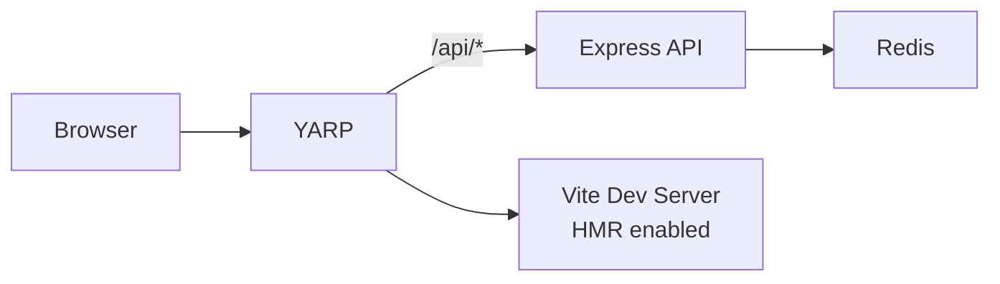
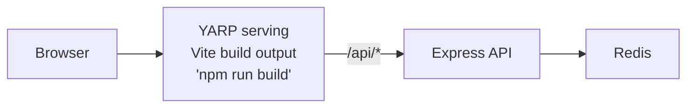

# Node.js Express + Redis + Vite Frontend

Visit counter with Express backend, Redis caching, and React TypeScript frontend using YARP.

## Architecture

**Run Mode:**


**Publish Mode:**


## What This Demonstrates

- **AddNodeApp**: Express backend with Redis integration
- **AddViteApp**: React + TypeScript frontend with Vite
- **AddYarp**: Single endpoint for frontend and API with path transforms
- **AddRedis**: In-memory data store with automatic connection injection
- **PublishWithStaticFiles**: Frontend embedded in YARP for publish mode
- **Dual-Mode Operation**: Vite HMR in run mode, Vite build output in publish mode

## Running

```bash
aspire run
```

## Commands

```bash
aspire run      # Run locally
aspire deploy   # Deploy to Docker Compose
aspire do docker-compose-down-dc  # Teardown deployment
```

## Key Aspire Patterns

**YARP Routing** - Single endpoint with path-based routing:
```csharp
builder.AddYarp("app")
    .WithConfiguration(c =>
    {
        c.AddRoute("api/{**catch-all}", api)
         .WithTransformPathRemovePrefix("/api");

        if (builder.ExecutionContext.IsRunMode)
            c.AddRoute("{**catch-all}", frontend); // Run: proxy to Vite
    })
    .PublishWithStaticFiles(frontend); // Publish: serve static files
```

**Redis Connection** - Automatic connection string injection via `REDIS_URI` environment variable

**WaitFor** - Ensures Redis starts before API
