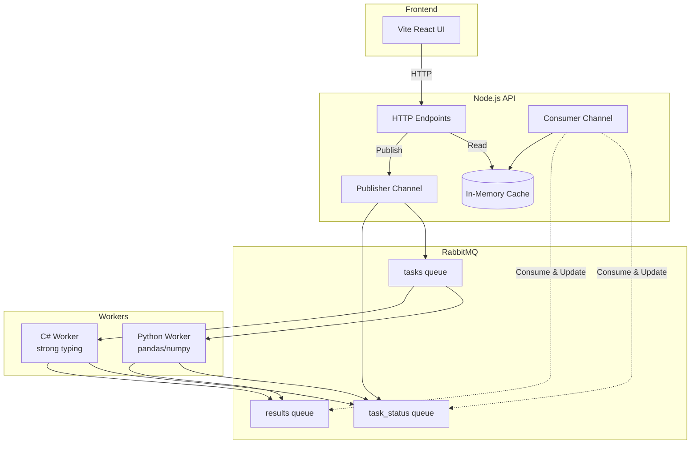

# Polyglot Task Queue

Distributed task processing with Python, C#, and Node.js workers using RabbitMQ and end-to-end OpenTelemetry tracing.

## Architecture



**RabbitMQ is the source of truth** - API maintains in-memory cache built from consuming messages.

## What This Demonstrates

- **AddRabbitMQ**: Message queue with management plugin
- **AddNodeApp**: Express API with dual RabbitMQ channels (publisher + consumer)
- **AddPythonApp**: Python worker with pandas/numpy for data analysis
- **AddCSharpApp**: C# worker with strong typing for reports
- **AddViteApp**: React + TypeScript frontend
- **OpenTelemetry**: End-to-end distributed tracing across all services
- **Trace Context Propagation**: OpenTelemetry context through RabbitMQ headers
- **Messaging Semantic Conventions**: Standardized span attributes for queue operations
- **Event-Driven State**: Stateless API, RabbitMQ as source of truth

## Running

```bash
aspire run
```

## Commands

```bash
aspire run      # Run locally
aspire deploy   # Deploy to Docker Compose
aspire do docker-compose-down-dc  # Teardown deployment
```

## Key Aspire Patterns

**RabbitMQ Setup** - Message queue with management UI:
```csharp
var rabbitmq = builder.AddRabbitMQ("rabbitmq")
    .WithManagementPlugin();
```

**OpenTelemetry** - Automatic configuration via environment variables:
- `OTEL_EXPORTER_OTLP_ENDPOINT`: Aspire dashboard endpoint
- `OTEL_SERVICE_NAME`: Service identifier for traces

**Service References** - Automatic connection injection:
```csharp
var api = builder.AddNodeApp("api", "./api", scriptPath: "index.js")
    .WithReference(rabbitmq); // Injects RABBITMQ_URI
```

**Trace Context Propagation** - OpenTelemetry context through message headers:
```javascript
// Node.js - Inject context
propagation.inject(context.active(), headers);
channel.sendToQueue(queue, Buffer.from(JSON.stringify(message)), { headers });

// Extract context
const parentContext = propagation.extract(context.active(), msg.properties.headers);
```

```python
# Python - Extract context
ctx = propagate.extract(dict(message.headers) if message.headers else {})
with tracer.start_as_current_span('process task', context=ctx):
    # Process task
```

**Messaging Semantic Conventions**:
- `messaging.system`: "rabbitmq"
- `messaging.destination.name`: Queue name
- `messaging.operation`: "publish" or "process"
