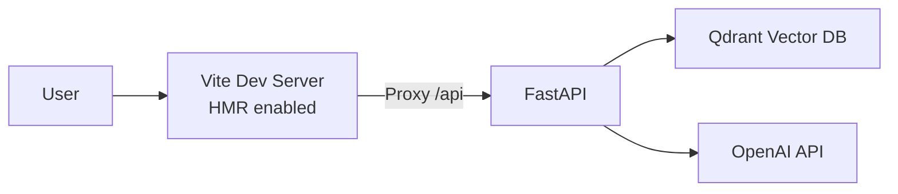
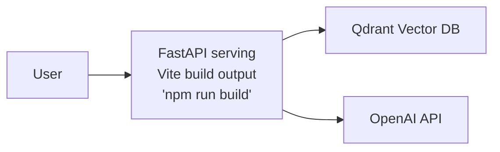

# RAG Document Q&A with Svelte

Upload documents and ask questions using Retrieval Augmented Generation with vector search.

## Architecture

**Run Mode:**


**Publish Mode:**


## What This Demonstrates

- **RAG Pattern**: Document upload → chunk → embed → vector search → GPT answer
- **AddUvicornApp**: Python FastAPI backend with uv package manager
- **AddViteApp**: Svelte 5 frontend with Vite
- **AddQdrant**: Vector database for semantic search
- **AddOpenAI**: Secure API key management
- **PublishWithContainerFiles**: Frontend embedded in API for publish mode

## Running

```bash
aspire run
```

Aspire will prompt for your OpenAI API key on first run.

## Commands

```bash
aspire run      # Run locally
aspire deploy   # Deploy to Docker Compose
aspire do docker-compose-down-dc  # Teardown deployment
```

## Key Aspire Patterns

**Static File Embedding** - Frontend proxied in run mode, embedded in publish mode:
```csharp
var api = builder.AddUvicornApp("api", "./api", "main:app")
    .WithUv();

var frontend = builder.AddViteApp("frontend", "./frontend")
    .WithReference(api);

api.PublishWithContainerFiles(frontend, "public");
```

**Python + uv** - Fast dependency installation from `pyproject.toml`

**Vector Database** - `AddQdrant()` for semantic search

**OpenAI Integration** - `AddOpenAI()` prompts for API key on first run
