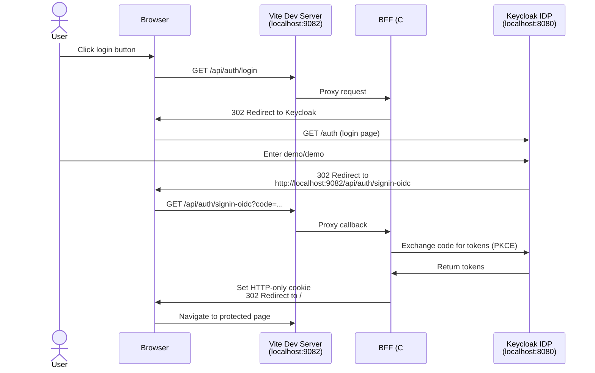
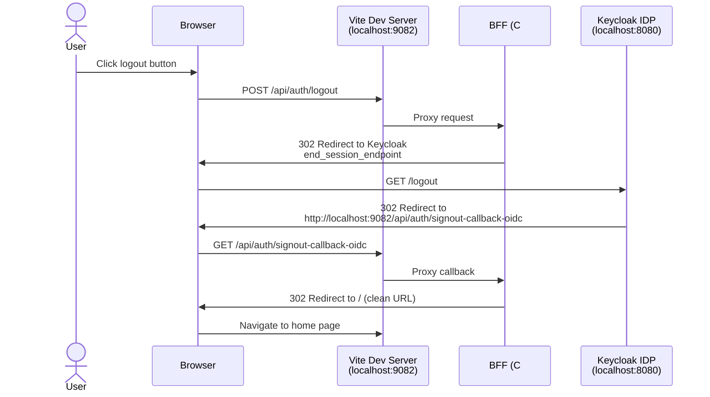

# Vite + C# BFF with Keycloak Authentication

> **⚠️ DEVELOPMENT ONLY**: This sample demonstrates Keycloak integration for learning purposes. It contains security configurations that are **NOT suitable for production environments**. See [Security Notes](#️-security-notes) for details.

BFF (Backend for Frontend) pattern demonstrating cookie-based authentication with Keycloak as the identity provider. Single C# project serving Vite frontend with protected and public pages.

## Architecture (Run Mode)

In run mode, the Vite dev server (port 9082) serves the frontend with HMR enabled, while the BFF (port 5254) handles authentication and API requests. Keycloak redirects are configured to go to the Vite URL first, which then proxies them to the BFF.

### Login & Authentication Flow


### Logout Flow


> **Note**: In publish mode, the BFF serves the built frontend from `wwwroot` and Keycloak redirects go directly to the BFF instead of being proxied through Vite.

## How It Works

### BFF Authentication Flow

1. **Login**: User clicks login → BFF challenges with OIDC
2. **Keycloak**: Redirects to Keycloak login page (demo realm)
3. **Callback**: After authentication, Keycloak redirects to `/api/auth/signin-oidc`
4. **Cookie**: BFF issues secure HTTP-only cookie for session
5. **Protected Routes**: Frontend checks auth state, calls protected API endpoints

### Security Model

- **PKCE**: Proof Key for Code Exchange enabled for enhanced security
- **No tokens in frontend**: Tokens never exposed to frontend JavaScript
- **Cookie-based sessions**: HTTP-only cookies for session management
- **Authorization code flow**: Standard OIDC flow (not implicit)
- **POST for logout**: State-changing operations use proper HTTP verbs
- **Generated secrets**: Client secret auto-generated with 128 bits of entropy
- Demo credentials: `demo` / `demo` (for development only)

## What This Demonstrates

- **BFF Pattern**: Single C# backend serving frontend and handling auth
- **Keycloak Integration**: OIDC authentication with Aspire.Keycloak.Authentication package
- **Realm Import with Variables**: Automatic realm configuration using environment variable substitution
- **Parameter Generation**: Auto-generated client secrets with configurable entropy
- **PKCE Support**: Enhanced OAuth security with Proof Key for Code Exchange
- **Cookie-based Auth**: Secure session management without exposing tokens
- **Protected Routes**: React Router with authentication checks
- **Service Discovery**: Automatic Keycloak URL resolution via Aspire
- **Dual-Mode URLs**: Different redirect URLs for run mode (Vite) vs publish mode (BFF)
- **Container Files**: Vite build output embedded in BFF container

## ⚠️ Security Notes

**This sample is for development and learning purposes only. The Keycloak integration is not production-ready.**

### Security Issues for Development Only

**BFF Configuration:**
- ✅ **PKCE Enabled**: Proof Key for Code Exchange provides protection against authorization code interception
- ✅ **POST for Logout**: Prevents CSRF attacks on logout endpoint
- ✅ **Forwarded Headers (Dev Only)**: Enabled via `ASPNETCORE_FORWARDEDHEADERS_ENABLED` in development mode only
- ❌ **RequireHttpsMetadata = false**: Disables HTTPS validation for Keycloak metadata endpoints - allows HTTP in development but vulnerable to MITM attacks
- ❌ **No Cookie Security Settings**: Missing SameSite, Secure flags for production
- ❌ **Open Redirect**: Login endpoint accepts unvalidated `returnUrl` parameter
- ❌ **Claims Exposure**: All user claims exposed to frontend via `/api/auth/user` endpoint

**Keycloak Realm Configuration:**
- ❌ **SSL Not Required**: `sslRequired: "none"` allows unencrypted connections
- ❌ **Hardcoded Credentials**: Demo user password (`demo`/`demo`) embedded in realm configuration
- ❌ **No Token Lifetimes**: Default token expiration settings may be too permissive
- ❌ **No Refresh Token Rotation**: Refresh tokens not configured to rotate on use

**Missing for Production:**
- ❌ **Rate Limiting**: No protection against brute force attacks on login
- ❌ **HTTPS Enforcement**: No HSTS or HTTPS redirection
- ❌ **Content Security Policy**: No CSP headers to prevent XSS
- ❌ **Session Management**: No session timeout or sliding expiration configured
- ❌ **Audit Logging**: No authentication event logging

### Making This Production-Ready

To deploy this pattern to production, you would need to:

1. **Enable HTTPS everywhere**: Set `RequireHttpsMetadata = true`, `sslRequired = "external"`, configure HSTS
2. **Configure cookie security**: Set `SameSite = SameSiteMode.Strict`, `Secure = true`, `HttpOnly = true`
3. **Validate redirects**: Implement allowlist for `returnUrl` parameter
4. **Remove hardcoded credentials**: Use proper user provisioning, password policies
5. **Configure token lifetimes**: Set appropriate access token, refresh token, and session timeouts
6. **Enable refresh token rotation**: Configure `UseRotationStrategy` in Keycloak
7. **Add rate limiting**: Implement login attempt throttling and account lockout
8. **Add audit logging**: Log all authentication events for security monitoring
9. **Implement CSP**: Add Content-Security-Policy headers to prevent XSS attacks
10. **Filter claims exposure**: Only return necessary claims to frontend, not all claims
11. **Configure forwarded headers**: If using a reverse proxy, explicitly configure `KnownProxies` or `KnownNetworks`

**Note**: The Aspire.Hosting.Keycloak integration is currently in preview and not recommended for production environments. For production, deploy Keycloak separately with proper hardening, monitoring, and backup strategies.

## Running Locally

```bash
aspire run
```

Access the app and login with:
- **Username**: demo
- **Password**: demo

## Project Structure

```
vite-csharp-keycloak/
├── apphost.cs                 # Aspire orchestration with parameter generation
├── Realms/
│   └── demo-realm.json        # Keycloak realm with ${BFF_URL} and ${BFF_CLIENT_SECRET}
├── bff/
│   ├── Program.cs             # BFF with OIDC + cookie auth + PKCE
│   ├── Extensions.cs          # Service defaults (health checks, OpenTelemetry)
│   ├── Extensions/
│   │   ├── AuthEndpoints.cs   # Login, logout, user info with Keycloak claims
│   │   └── DataEndpoints.cs   # Protected data endpoints
├── frontend/
│   ├── src/
│   │   ├── pages/
│   │   │   ├── Home.tsx       # Public page
│   │   │   └── Protected.tsx  # Protected page (requires auth)
│   │   ├── components/
│   │   │   └── Navbar.tsx     # Login/logout buttons
│   │   └── hooks/
│   │       └── useAuth.tsx    # Auth context and state
```

## Key Aspire Patterns

### Auto-Generated Client Secrets
The BFF client secret is automatically generated with 128 bits of entropy using `GenerateParameterDefault`. The secret is stored securely and passed to both Keycloak and the BFF via environment variables, eliminating the need to hardcode credentials.

### Realm Configuration with Variable Substitution
The Keycloak realm configuration (`Realms/demo-realm.json`) uses environment variable placeholders:
- `${BFF_CLIENT_SECRET}` - Auto-generated OAuth client secret
- `${BFF_URL}` - Dynamic redirect URL (differs in run vs publish mode)

These variables are replaced at runtime when Keycloak imports the realm, enabling a single realm definition that works across environments.

### Dual-Mode Redirect URLs
**Run Mode:** Keycloak redirects OAuth callbacks to the Vite dev server (`http://localhost:9082`), which proxies them to the BFF. This preserves HMR and the development experience.

**Publish Mode:** Keycloak redirects OAuth callbacks directly to the BFF HTTPS endpoint, since the BFF serves the built frontend from `wwwroot`.

The AppHost automatically configures `BFF_URL` based on execution context (`IsRunMode`).

### Keycloak Authentication with PKCE
Uses `Aspire.Keycloak.Authentication` package with:
- Cookie + OpenID Connect authentication schemes
- PKCE (Proof Key for Code Exchange) for enhanced security
- Automatic service discovery to resolve Keycloak URLs
- Custom callback path: `/api/auth/signin-oidc`
- Client secret from configuration (not hardcoded)

### Container Files Publishing
In publish mode, Vite build output (`npm run build`) is embedded in the BFF container at `wwwroot`, creating a single deployable artifact.

## Authentication Endpoints

**Login** - `GET /api/auth/login?returnUrl=/protected`
Initiates OIDC flow, redirects to Keycloak

**Logout** - `POST /api/auth/logout`
Signs out of local cookie session and Keycloak (full logout with redirect to Keycloak's end_session_endpoint)

**Signin Callback** - `GET /api/auth/signin-oidc`
OAuth callback endpoint where Keycloak redirects after authentication (handled by OIDC middleware)

**Signout Callback** - `GET /api/auth/signout-callback-oidc`
Handles the return from Keycloak after logout, redirects to clean root URL without query parameters

**User Info** - `GET /api/auth/user`
Returns current user info with Keycloak standard claims (preferred_username, email, given_name, family_name)

**Protected Data** - `GET /api/data/profile` (requires auth)
Example protected endpoint demonstrating authorization

## React Authentication Hook

The frontend uses a custom `useAuth` hook for authentication state:

```typescript
const { user, loading, login, logout } = useAuth()

// Check authentication
if (!user?.authenticated) {
  return <button onClick={() => login('/protected')}>Login</button>
}

// Display user info
<span>Welcome, {user.username}!</span>
```

Protected pages automatically check auth state and show login prompt if unauthenticated.
