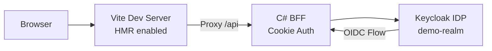
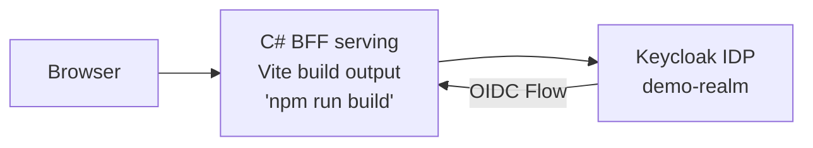

# Vite + C# BFF with Keycloak Authentication

BFF (Backend for Frontend) pattern demonstrating cookie-based authentication with Keycloak as the identity provider. Single C# project serving Vite frontend with protected and public pages.

## Architecture

**Run Mode:**


**Publish Mode:**


## How It Works

### BFF Authentication Flow

1. **Login**: User clicks login → BFF challenges with OIDC
2. **Keycloak**: Redirects to Keycloak login page (demo-realm)
3. **Callback**: After authentication, Keycloak redirects back to BFF
4. **Cookie**: BFF issues secure HTTP-only cookie for session
5. **Protected Routes**: Frontend checks auth state, calls protected API endpoints

### Security Model

- No tokens exposed to frontend JavaScript
- Cookie-based session management (HTTP-only, secure)
- OIDC authorization code flow (not implicit)
- Protected API endpoints require authentication
- Demo credentials: `demo` / `demo`

## What This Demonstrates

- **BFF Pattern**: Single C# backend serving frontend and handling auth
- **Keycloak Integration**: OIDC authentication with Aspire.Keycloak.Authentication package
- **Realm Import**: Automatic Keycloak realm configuration on startup
- **Cookie-based Auth**: Secure session management without exposing tokens
- **Protected Routes**: React Router with authentication checks
- **Service Discovery**: Automatic Keycloak URL resolution via Aspire
- **Container Files**: Vite build output embedded in BFF container

## Running Locally

```bash
aspire run
```

Access the app and login with:
- **Username**: demo
- **Password**: demo

## Project Structure

```
vite-csharp-keycloak/
├── apphost.cs                 # Aspire orchestration
├── Realms/
│   └── demo-realm.json        # Keycloak realm configuration
├── bff/
│   ├── Program.cs             # BFF with OIDC + cookie auth
│   ├── Extensions/
│   │   ├── AuthEndpoints.cs   # Login, logout, user info
│   │   └── DataEndpoints.cs   # Protected data endpoints
├── frontend/
│   ├── src/
│   │   ├── pages/
│   │   │   ├── Home.tsx       # Public page
│   │   │   └── Protected.tsx  # Protected page (requires auth)
│   │   ├── components/
│   │   │   └── Navbar.tsx     # Login/logout buttons
│   │   └── hooks/
│   │       └── useAuth.tsx    # Auth context and state
```

## Key Aspire Patterns

**Keycloak with Realm Import** - Automatic realm configuration on startup:
```csharp
var keycloak = builder.AddKeycloak("keycloak")
                      .WithDataVolume()        // Persist data between runs
                      .WithRealmImport("./Realms"); // Import demo-realm.json
```

**Keycloak Authentication** - OIDC configuration with Aspire integration:
```csharp
builder.Services.AddAuthentication(OpenIdConnectDefaults.AuthenticationScheme)
    .AddKeycloakOpenIdConnect(
        "keycloak",
        realm: "demo-realm",
        options =>
        {
            options.ClientId = "bff-client";
            options.ClientSecret = "bff-client-secret";
            options.ResponseType = "code";
        });
```

Uses `Aspire.Keycloak.Authentication` package to automatically configure OpenID Connect with the Keycloak realm using Aspire service discovery.

**Container Files Publishing** - Embed Vite build output in BFF container:
```csharp
bff.PublishWithContainerFiles(frontend, "wwwroot");
```

In run mode, Vite dev server runs with HMR. In publish mode, `npm run build` output is copied to BFF's wwwroot.

**Service References** - Frontend proxies API calls to BFF:
```csharp
var frontend = builder.AddViteApp("frontend", "./frontend")
                      .WithReference(bff);
```

Enables Vite dev server to proxy `/api` requests to the BFF.

## Authentication Endpoints

**Login** - `GET /api/auth/login?returnUrl=/protected`
Initiates OIDC flow, redirects to Keycloak

**Logout** - `POST /api/auth/logout`
Clears session cookie, signs out from Keycloak

**User Info** - `GET /api/auth/user`
Returns current user info (username, email, claims)

**Protected Data** - `GET /api/data/profile` (requires auth)
Example protected endpoint demonstrating authorization

## React Authentication Hook

The frontend uses a custom `useAuth` hook for authentication state:

```typescript
const { user, loading, login, logout } = useAuth()

// Check authentication
if (!user?.authenticated) {
  return <button onClick={() => login('/protected')}>Login</button>
}

// Display user info
<span>Welcome, {user.username}!</span>
```

Protected pages automatically check auth state and show login prompt if unauthenticated.
