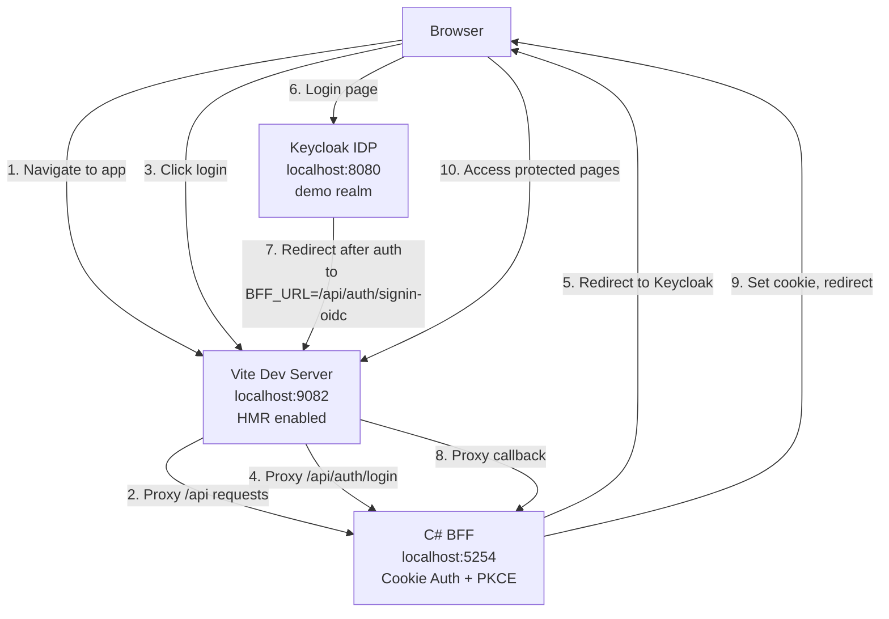
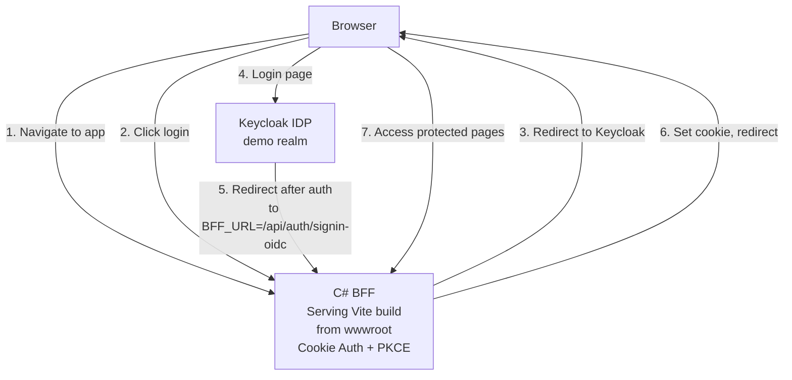

# Vite + C# BFF with Keycloak Authentication

BFF (Backend for Frontend) pattern demonstrating cookie-based authentication with Keycloak as the identity provider. Single C# project serving Vite frontend with protected and public pages.

## Architecture

### Run Mode Architecture


In run mode, Keycloak is configured with `BFF_URL=http://localhost:9082` (Vite frontend URL). All OAuth redirects go to Vite first, which then proxies the callback to the BFF.

### Publish Mode Architecture


In publish mode, Keycloak is configured with `BFF_URL=https://bff-url` (BFF HTTPS endpoint). OAuth redirects go directly to the BFF since it's serving the frontend.

## How It Works

### BFF Authentication Flow

1. **Login**: User clicks login → BFF challenges with OIDC
2. **Keycloak**: Redirects to Keycloak login page (demo realm)
3. **Callback**: After authentication, Keycloak redirects to `/api/auth/signin-oidc`
4. **Cookie**: BFF issues secure HTTP-only cookie for session
5. **Protected Routes**: Frontend checks auth state, calls protected API endpoints

### Security Model

- **PKCE**: Proof Key for Code Exchange enabled for enhanced security
- **No tokens in frontend**: Tokens never exposed to frontend JavaScript
- **Cookie-based sessions**: HTTP-only, secure cookies for session management
- **Authorization code flow**: Standard OIDC flow (not implicit)
- **Forwarded headers**: Proxy support for X-Forwarded-* headers
- **Generated secrets**: Client secret auto-generated with 128 bits of entropy
- Demo credentials: `demo` / `demo`

## What This Demonstrates

- **BFF Pattern**: Single C# backend serving frontend and handling auth
- **Keycloak Integration**: OIDC authentication with Aspire.Keycloak.Authentication package
- **Realm Import with Variables**: Automatic realm configuration using environment variable substitution
- **Parameter Generation**: Auto-generated client secrets with configurable entropy
- **PKCE Support**: Enhanced OAuth security with Proof Key for Code Exchange
- **Cookie-based Auth**: Secure session management without exposing tokens
- **Protected Routes**: React Router with authentication checks
- **Service Discovery**: Automatic Keycloak URL resolution via Aspire
- **Dual-Mode URLs**: Different redirect URLs for run mode (Vite) vs publish mode (BFF)
- **Container Files**: Vite build output embedded in BFF container

## Running Locally

```bash
aspire run
```

Access the app and login with:
- **Username**: demo
- **Password**: demo

## Project Structure

```
vite-csharp-keycloak/
├── apphost.cs                 # Aspire orchestration with parameter generation
├── Realms/
│   └── demo-realm.json        # Keycloak realm with ${BFF_URL} and ${BFF_CLIENT_SECRET}
├── bff/
│   ├── Program.cs             # BFF with OIDC + cookie auth + PKCE
│   ├── Extensions.cs          # Service defaults (health checks, OpenTelemetry)
│   ├── Extensions/
│   │   ├── AuthEndpoints.cs   # Login, logout, user info with Keycloak claims
│   │   └── DataEndpoints.cs   # Protected data endpoints
├── frontend/
│   ├── src/
│   │   ├── pages/
│   │   │   ├── Home.tsx       # Public page
│   │   │   └── Protected.tsx  # Protected page (requires auth)
│   │   ├── components/
│   │   │   └── Navbar.tsx     # Login/logout buttons
│   │   └── hooks/
│   │       └── useAuth.tsx    # Auth context and state
```

## Key Aspire Patterns

### Auto-Generated Client Secrets
The BFF client secret is automatically generated with 128 bits of entropy using `GenerateParameterDefault`. The secret is stored securely and passed to both Keycloak and the BFF via environment variables, eliminating the need to hardcode credentials.

### Realm Configuration with Variable Substitution
The Keycloak realm configuration (`Realms/demo-realm.json`) uses environment variable placeholders:
- `${BFF_CLIENT_SECRET}` - Auto-generated OAuth client secret
- `${BFF_URL}` - Dynamic redirect URL (differs in run vs publish mode)

These variables are replaced at runtime when Keycloak imports the realm, enabling a single realm definition that works across environments.

### Dual-Mode Redirect URLs
**Run Mode:** Keycloak redirects OAuth callbacks to the Vite dev server (`http://localhost:9082`), which proxies them to the BFF. This preserves HMR and the development experience.

**Publish Mode:** Keycloak redirects OAuth callbacks directly to the BFF HTTPS endpoint, since the BFF serves the built frontend from `wwwroot`.

The AppHost automatically configures `BFF_URL` based on execution context (`IsRunMode`).

### Keycloak Authentication with PKCE
Uses `Aspire.Keycloak.Authentication` package with:
- Cookie + OpenID Connect authentication schemes
- PKCE (Proof Key for Code Exchange) for enhanced security
- Automatic service discovery to resolve Keycloak URLs
- Custom callback path: `/api/auth/signin-oidc`
- Client secret from configuration (not hardcoded)

### Container Files Publishing
In publish mode, Vite build output (`npm run build`) is embedded in the BFF container at `wwwroot`, creating a single deployable artifact.

## Authentication Endpoints

**Login** - `GET /api/auth/login?returnUrl=/protected`
Initiates OIDC flow, redirects to Keycloak

**Logout** - `GET /api/auth/logout`
Signs out of local cookie session and Keycloak (full logout with redirect to Keycloak's end_session_endpoint)

**Callback** - `GET /api/auth/signin-oidc`
OAuth callback endpoint where Keycloak redirects after authentication (handled by OIDC middleware)

**User Info** - `GET /api/auth/user`
Returns current user info with Keycloak standard claims (preferred_username, email, given_name, family_name)

**Protected Data** - `GET /api/data/profile` (requires auth)
Example protected endpoint demonstrating authorization

## React Authentication Hook

The frontend uses a custom `useAuth` hook for authentication state:

```typescript
const { user, loading, login, logout } = useAuth()

// Check authentication
if (!user?.authenticated) {
  return <button onClick={() => login('/protected')}>Login</button>
}

// Display user info
<span>Welcome, {user.username}!</span>
```

Protected pages automatically check auth state and show login prompt if unauthenticated.
