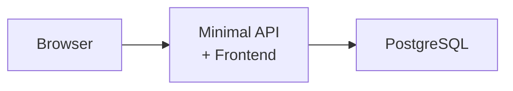

# ASP.NET Core Minimal API + PostgreSQL + Vite Sample

**ASP.NET Core Minimal API with PostgreSQL database and React TypeScript frontend using YARP.**

This sample demonstrates Aspire 13's C# support with a fullstack todo application featuring Minimal APIs, Entity Framework Core, PostgreSQL, and a modern Vite + React + TypeScript frontend.

## Quick Start

### Prerequisites

- [Aspire CLI](https://aspire.dev/get-started/install-cli/)
- [Docker](https://docs.docker.com/get-docker/)
- [.NET 10 SDK](https://dotnet.microsoft.com/download/dotnet/10.0)
- [Node.js 22+](https://nodejs.org/)

### Commands

```bash
aspire run      # Run locally
aspire deploy   # Deploy to Docker Compose
aspire do docker-compose-down-dc  # Teardown deployment
```

## Overview

The application consists of:

- **Aspire AppHost** - Orchestrates the .NET API, Vite frontend, and PostgreSQL
- **Vite Frontend** - React + TypeScript UI
- **ASP.NET Core API** - Minimal APIs with EF Core and static file serving
- **PostgreSQL** - Relational database with pgAdmin

## Architecture



In development, the Vite dev server runs separately with HMR. In publish mode, the frontend is built and served as static files from the API's wwwroot directory via `UseFileServer()`.

## Key Code

The AppHost configuration demonstrates C# app integration with PostgreSQL and frontend publishing:

```csharp
var builder = DistributedApplication.CreateBuilder(args);

builder.AddDockerComposeEnvironment("dc");

var postgres = builder.AddPostgres("postgres")
                      .WithPgAdmin()
                      .AddDatabase("db");

var api = builder.AddCSharpApp("api", "./api")
                 .WithHttpHealthCheck("/health")
                 .WithExternalHttpEndpoints()
                 .WaitFor(postgres)
                 .WithReference(postgres)
                 .WithUrls(context =>
                 {
                     // Hide default URLs from dashboard
                     foreach (var url in context.Urls)
                     {
                         url.DisplayLocation = UrlDisplayLocation.DetailsOnly;
                     }

                     // Add Scalar API reference link
                     context.Urls.Add(new()
                     {
                         Url = "/scalar",
                         DisplayText = "API Reference",
                         Endpoint = context.GetEndpoint("https")
                     });
                 });

var frontend = builder.AddViteApp("frontend", "./frontend")
                      .WithReference(api)
                      .WithUrl("", "Todo UI");

// Publish frontend as container files to API's wwwroot
api.PublishWithContainerFiles(frontend, "wwwroot");

builder.Build().Run();
```

Key features:

- **Aspire Service Defaults**: Built-in observability, resilience, and service discovery
- **Container Files Publishing**: Frontend build artifacts served from API's wwwroot
- **Dual-Mode Operation**: Dev mode uses Vite HMR, publish mode serves static files from API
- **Minimal APIs**: Modern C# API approach without controllers
- **EF Core 10**: Entity Framework Core with PostgreSQL provider
- **PostgreSQL Integration**: Aspire provides connection via `AddNpgsqlDbContext`
- **Scalar**: Beautiful OpenAPI documentation UI (development only)
- **Custom Dashboard URLs**: Scalar link and Todo UI link in Aspire dashboard
- **pgAdmin**: Web UI for database management
- **Startup Dependencies**: API waits for PostgreSQL before starting
- **OpenTelemetry**: Full observability with traces, metrics, and logs

## API Endpoints

**Aspire Default Endpoints:**
- `GET /health` - Health check
- `GET /alive` - Liveness check
- `GET /` - Serves static frontend files (or Vite proxy in dev)

**Todo API:**
- `GET /todos` - Get all todos
- `GET /todos/{id}` - Get todo by ID
- `POST /todos` - Create a new todo
- `PUT /todos/{id}` - Update todo
- `DELETE /todos/{id}` - Delete todo

**API Documentation (Development only):**
- `GET /openapi/v1.json` - OpenAPI specification
- `GET /scalar/v1` - Scalar API documentation UI

## Example Usage

**Using the Web UI:**

Open the "Todo UI" link in the Aspire dashboard. The UI allows you to:
- Add new todos
- Mark todos as complete/incomplete
- Delete todos
- View remaining items count

**Using the API directly:**

```bash
# Create todos
curl -X POST http://localhost:[port]/todos \
  -H "Content-Type: application/json" \
  -d '{"title":"Buy groceries"}'

curl -X POST http://localhost:[port]/todos \
  -H "Content-Type: application/json" \
  -d '{"title":"Write code"}'

# Get all todos
curl http://localhost:[port]/todos

# Update a todo
curl -X PUT http://localhost:[port]/todos/1 \
  -H "Content-Type: application/json" \
  -d '{"completed":true}'

# Delete a todo
curl -X DELETE http://localhost:[port]/todos/1
```

*Note: Replace `[port]` with the actual port from the Aspire dashboard.*

**Accessing API Documentation:**

Click the "API Reference" link in the Aspire dashboard to explore the OpenAPI documentation with Scalar (development mode only).

## How It Works

1. **Service Defaults**: `AddServiceDefaults()` configures observability, health checks, and resilience
2. **Dependency Installation**: Aspire automatically runs `npm install` for frontend and restores .NET packages
3. **PostgreSQL Connection**: Aspire provides connection via `AddNpgsqlDbContext<TodoDbContext>("db")`
4. **Database Initialization**: Hosted service runs on startup to create database and apply migrations with detailed logging
5. **Static File Serving**:
   - In dev mode, Vite dev server runs separately with HMR
   - In publish mode, `UseFileServer()` serves frontend build from wwwroot directory
6. **CRUD Operations**: Minimal APIs (mapped via `MapTodos()`) handle create, read, update, delete operations
7. **API Documentation**: OpenAPI and Scalar are available in development mode only
8. **Observability**: OpenTelemetry automatically captures traces, metrics, and logs

## Deployment

Deploy to Docker Compose:

```bash
aspire deploy
```

This will:

1. Build the Vite frontend to static files
2. Package frontend files into the API container's wwwroot directory
3. Build the .NET API container with embedded frontend
4. Generate Docker Compose files with PostgreSQL
5. Deploy the complete application stack with the API serving both frontend and API endpoints

## Database Access

Access pgAdmin from the Aspire Dashboard to:
- View the `db` database
- Browse the `todos` table
- Run SQL queries
- Manage database schema
