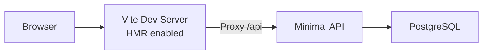
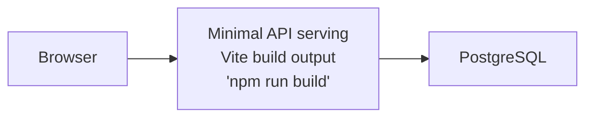

# ASP.NET Core Minimal API + PostgreSQL + Vite

Todo app with C# Minimal APIs, Entity Framework Core, PostgreSQL, and React TypeScript frontend.

## Architecture

**Run Mode:**


**Publish Mode:**


## What This Demonstrates

- **AddCSharpApp**: ASP.NET Core Minimal API with EF Core
- **AddViteApp**: React + TypeScript frontend with Vite
- **AddPostgres**: PostgreSQL database with pgAdmin
- **PublishWithContainerFiles**: Frontend embedded in API's wwwroot for publish mode
- **AddNpgsqlDbContext**: Automatic PostgreSQL connection injection
- **WithUrls**: Custom dashboard links (Scalar API docs, Todo UI)
- **WaitFor**: Ensures PostgreSQL starts before API

## Running

```bash
aspire run
```

## Commands

```bash
aspire run      # Run locally
aspire deploy   # Deploy to Docker Compose
aspire do docker-compose-down-dc  # Teardown deployment
```

## Key Aspire Patterns

**Container Files Publishing** - Frontend embedded in API's wwwroot:
```csharp
var postgres = builder.AddPostgres("postgres")
    .WithPgAdmin()
    .AddDatabase("db");

var api = builder.AddCSharpApp("api", "./api")
    .WithHttpHealthCheck("/health")
    .WaitFor(postgres)
    .WithReference(postgres)
    .WithUrls(context =>
    {
        context.Urls.Add(new()
        {
            Url = "/scalar",
            DisplayText = "API Reference",
            Endpoint = context.GetEndpoint("https")
        });
    });

var frontend = builder.AddViteApp("frontend", "./frontend")
    .WithReference(api)
    .WithUrl("", "Todo UI");

api.PublishWithContainerFiles(frontend, "wwwroot");
```

**EF Core Integration** - Automatic connection string injection:
```csharp
builder.AddNpgsqlDbContext<TodoDbContext>("db");
```

**Static File Serving** - API serves embedded frontend in publish mode:
```csharp
app.UseFileServer(); // Serves wwwroot/index.html and assets
```
