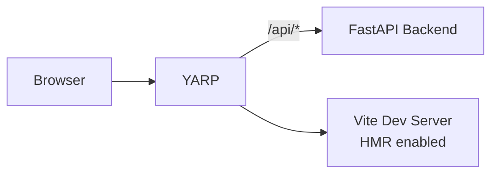

# Vite React + FastAPI

Todo app with React frontend and Python FastAPI backend using YARP for unified routing.

## Architecture

**Run Mode:**


**Publish Mode:**


## What This Demonstrates

- **AddUvicornApp**: Python FastAPI backend with uv package manager
- **AddViteApp**: React + TypeScript frontend with Vite
- **AddYarp**: Single endpoint with path-based routing
- **WithTransformPathRemovePrefix**: Strip `/api` prefix before forwarding
- **PublishWithStaticFiles**: Frontend embedded in YARP for publish mode
- **Dual-Mode Operation**: Vite HMR in run mode, Vite build output in publish mode
- **Polyglot Fullstack**: JavaScript + Python working together

## Running

```bash
aspire run
```

## Commands

```bash
aspire run      # Run locally
aspire deploy   # Deploy to Docker Compose
aspire do docker-compose-down-dc  # Teardown deployment
```

## Key Aspire Patterns

**YARP with Path Transform** - Strip `/api` prefix before forwarding to FastAPI:
```csharp
var api = builder.AddUvicornApp("api", "./api", "main:app")
    .WithUv()
    .WithHttpHealthCheck("/health");

var frontend = builder.AddViteApp("frontend", "./frontend")
    .WithReference(api);

builder.AddYarp("app")
    .WithConfiguration(c =>
    {
        c.AddRoute("api/{**catch-all}", api)
         .WithTransformPathRemovePrefix("/api"); // /api/todos → /todos

        if (builder.ExecutionContext.IsRunMode)
            c.AddRoute("{**catch-all}", frontend); // Run: proxy to Vite
    })
    .PublishWithStaticFiles(frontend); // Publish: serve static files
```

**Path Transform Example**:
- Client: `GET /api/todos`
- YARP receives: `/api/todos`
- Transform strips: `/api`
- FastAPI receives: `GET /todos`
