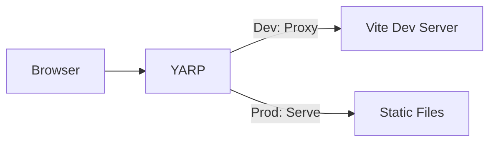

# YARP Serving Static Files

YARP reverse proxy serving a Vite frontend with dual-mode operation (dev HMR + production static files).

## Architecture



## What This Demonstrates

- **AddViteApp**: Vite-based frontend application
- **AddYarp**: Reverse proxy with dual-mode routing
- **PublishWithStaticFiles**: Automatic static file serving in production
- **ExecutionContext.IsRunMode**: Different behavior for dev vs production
- **Minimal AppHost**: Single-file orchestration

## Running

```bash
aspire run
```

## Commands

```bash
aspire run      # Run locally
aspire deploy   # Deploy to Docker Compose
aspire do docker-compose-down-dc  # Teardown deployment
```

## Key Aspire Patterns

**Dual-Mode YARP** - Dev proxies to Vite, production serves static files:
```csharp
var frontend = builder.AddViteApp("frontend", "./frontend");

builder.AddYarp("app")
    .WithConfiguration(c =>
    {
        if (builder.ExecutionContext.IsRunMode)
            c.AddRoute("{**catch-all}", frontend); // Dev: proxy to Vite HMR
    })
    .PublishWithStaticFiles(frontend); // Prod: serve static files
```

**Single Entry Point** - YARP provides one external endpoint for the entire application
